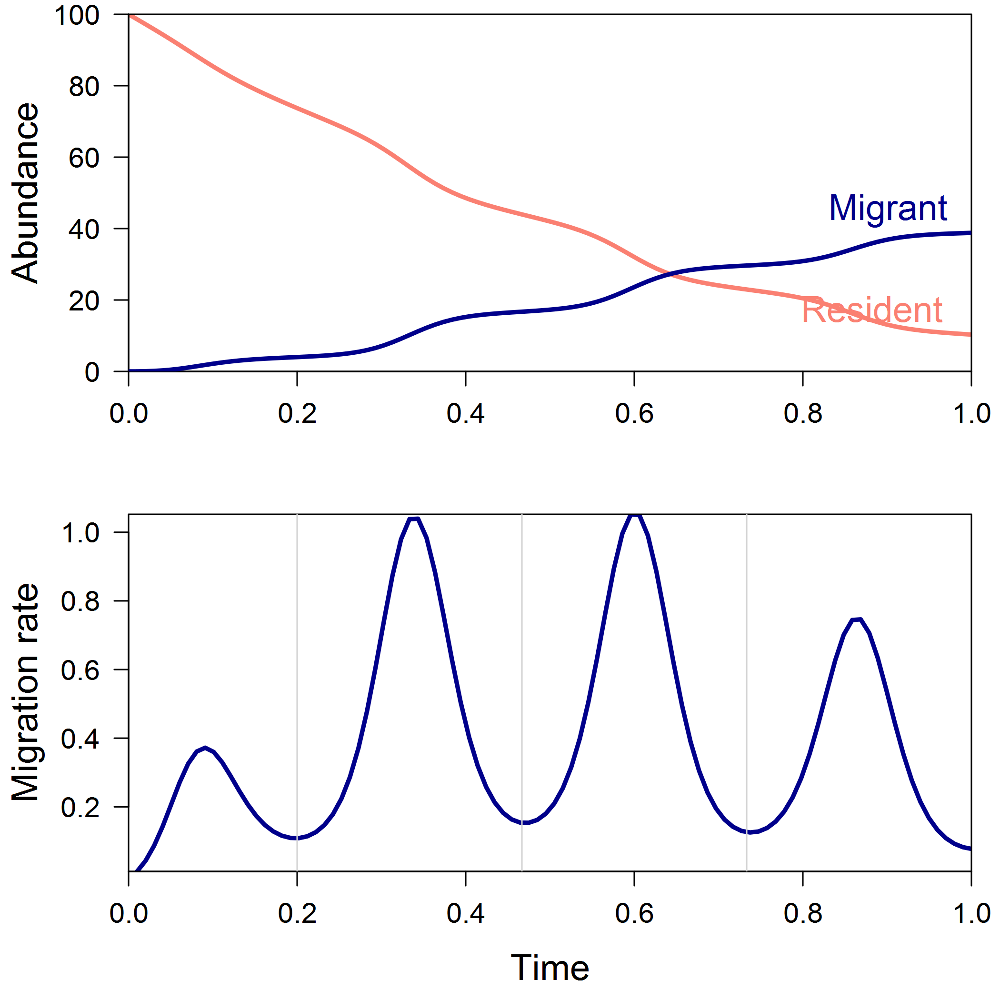
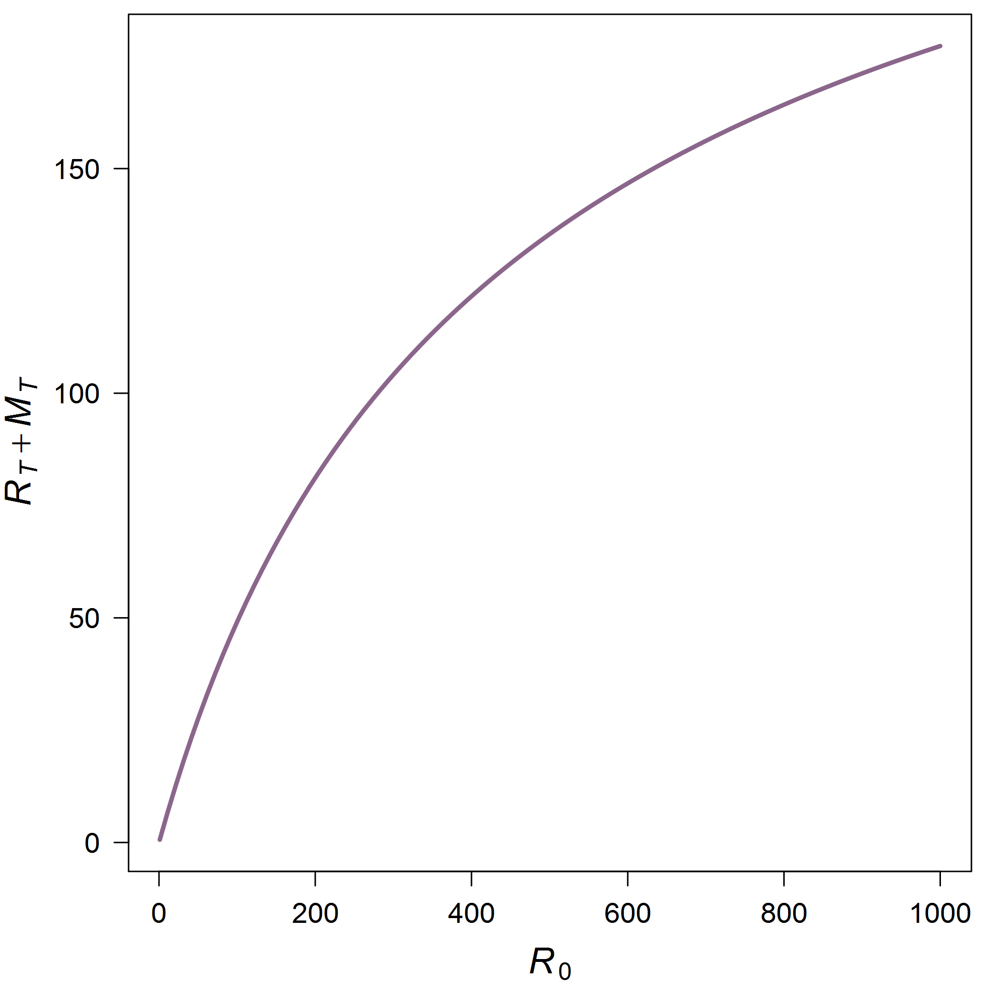

Discrete Density-Dependent Patterns in a Continuous Survival and
Emigration Process
================
Eric Buhle
2021-06-09

-   [Preamble](#preamble)
-   [A Toy Model](#a-toy-model)
-   [A Range of Simulations](#a-range-of-simulations)
-   [Summary](#summary)

## Preamble

Consider a population undergoing simultaneous, continuous-time processes
of mortality and emigration. A fixed initial cohort of residents
*R*<sub>0</sub> will decline toward zero, with the balance of losses
depending on the details of the functions governing survival and
dispersal over time. Further suppose that both mortality and emigration
are potentially density-dependent, and that we would like to infer the
structure and functional forms of such density dependence. The data
available to do this consist of an estimate of *R*<sub>0</sub> and
estimates of cumulative migration Δ*M*<sub>*t*</sub> over discrete time
steps (e.g., days) *t* - 1 to *t*. Let’s assume for the sake of
illustration that we observe both of these state variables without
error, and that the underlying dynamics are deterministic.

To make things concrete, suppose survival is density-dependent, while
emigration is density-independent but subject to periodic forcing. For
stream-rearing salmonids, this represents a minimal set of assumptions
that can serve as a sort of null model against which to measure any
empirical patterns we might observe in real data.

## A Toy Model

We can model these population dynamics as a simple system of ODEs using
the **deSolve** package in R. First we need to define the system as a
function. Let’s take the resident population dynamics *dR*/*dt* to be
logistic, with a negative intrinsic growth rate *r* since there is no
reproduction. Over a finite time step Δ*t* the logistic integrates to
give a Beverton-Holt function, and we can more easily parameterize by
the maximum (density-independent) survival *s*<sub>0</sub> and the
asymptote *R*<sub>max</sub>, which we then solve for the logistic
parameters *r* and *K*.

``` r
library(deSolve)

survive_migrate <- function(t, x, parms) 
{
  with(as.list(c(x, parms)), {
    r <- log(s0)
    K <- Rmax*(s0 - 1)/s0
    dRdt <- r*R*(1 - R/K) - dMdt(t, R, m, tau)
    dMdt <- dMdt(t, R, m, tau)
    
    return(list(c(dRdt, dMdt)))
  })
}
```

We’ll model the time-dependent per capita migration rate
(1/*R*)*dM*/*dt* as a periodic function with baseline rate *m*, period
*τ*, and a linear increase with time *t* so that the last migration
pulses are reasonably large even though few residents remain.

``` r
dMdt <- function(t, R, m, tau)
{
  R*m*t*exp(sin(2*pi*t/tau))
}
```

Now we can simulate the dynamics by numerically solving the ODEs. We’ll
set the forcing period so that there are four migration pulses over the
“migration season” of *T* = 100 time steps, which is normalized to
length 1.

``` r
times <- seq(0, 1, length = 100)
parms <- c(s0 = 0.50, Rmax = 100, m = 4, tau = max(times)/3.75)
RMt <- ode(func = survive_migrate, parms = parms, y = c(R = 100, M = 0), times = times)
RMt <- data.frame(RMt)
```

Here are the population dynamics. The lower panel shows the change in
cumulative emigration per time step – i.e., what we would observe in
discrete daily sampling. The vertical lines between migration pulses
define the partition we will use when looking for density dependence at
each stage.



## A Range of Simulations

To do that we first need to repeat the simulation over a range of
initial densities *R*<sub>0</sub>. This time we’ll only record
cumulative total emigrants Δ*M*<sub>*t*</sub> over each of the four
discrete intervals or stages indicated above.

We’ll also compute the additive log ratios of these stage-specific
totals, using the final stage as the reference category. The conceptual
motivation is that we can reparameterize the sequential stage-specific
density-dependent relationships (all based on initial cohort size, as
*R*(*t*) is not directly observed) into a single overall
density-dependent function and the proportions of migrants in each
stage, which may or may not show residual density dependence.

``` r
R0 <- seq(1, parms["Rmax"]*10, length = 100)
R0Mt <- do.call(rbind, lapply(R0, function(R) {
  out <- ode(func = survive_migrate, parms = parms, y = c(R = R, M = 0), 
             times = c(0, seq(0.75*parms["tau"], max(times), parms["tau"])))
  dplyr::mutate(data.frame(R0 = R, out), dM = c(NA, diff(M)), alrM = log(dM / tail(dM,1)))
}))
```

A plot of the final total of emigrants and surviving residents against
initial cohort size clearly shows the effect of density-dependent
resident survival. In fact, if the baseline emigration rate *m* were
zero, this curve would simply be the Beverton-Holt.



Now let’s examine density dependence in each stage-specific migrant
pulse from time *t* - 1 to *t*, with respect to initial cohort size.

<!-- -->

Again we see the signature of density-dependent resident survival, even
though we can only observe migrants and the instantaneous migration rate
itself is density-independent. Interestingly, the apparent strength of
density dependence increases steadily throughout the migration season
because the migrants are drawn from a pool of residents that has
experienced more and more density-dependent mortality.

Perhaps counterintuitively, the same patterns emerge when we transform
the compositional data (proportion of migrants in each pulse,
conditional on total migration) from the simplex to additive log-ratio
space. Because the loss of residents through density-dependent mortality
increases with initial cohort size and disproportionately reduces the
later migration pulses, the ratio of any earlier pulse to the final one
increases with *R*<sub>0</sub>, but in a saturating way. We could choose
different reference classes and get different but mathematically
equivalent patterns; the underlying residual density dependence would
remain.


## Summary

This simple thought experiment is helpful in formulating a null
hypothesis or baseline expectation of what we might see in empirical
data on daily emigration from a system simultaneously undergoing
mortality. One immediate conclusion is that density dependence of the
entire cohort with respect to initial abundance manifests in migrant
counts, even though the per capita migration rate itself and the timing
and magnitude of its peaks are density-independent.

It is also notable that the apparent strength of density dependence
increases across successive migration pulses or stages. The plot of
Δ*M*<sub>*t*</sub> vs. *R*<sub>0</sub> in the first pulse is not
depensatory, but if compensation were weaker than in this example and in
the presence of correlated environmental stochasticity and observation
noise, it could easily be mistaken for linear.

Unfortunately, the log-ratio transformation does not appear to remove
the density dependence, suggesting we cannot cleanly reparameterize from
the abundance of each migrant pulse to the total abundance and relative
frequency in each successive stage.
